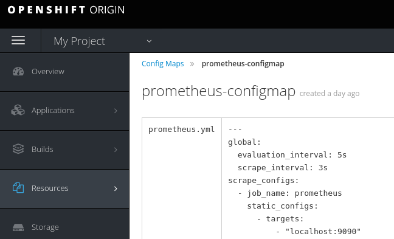
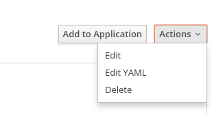

= Manually making a service visible to the Metrics Service

== Prerequesites

* OpenShift Origin >= 3.7
** https://docs.openshift.org/latest/install_config/index.html
* OpenShift Ansible Broker
** https://docs.openshift.org/latest/install_config/install/advanced_install.html#configuring-openshift-ansible-broker
* Metrics service deployment from the Service Catalog
** https://github.com/aerogearcatalog/metrics-apb

== Adding a service to the Metrics Service

The Metrics Service is composed of both https://grafana.com/[Grafana]
for data visualization and https://prometheus.io/[Prometheus] for
gathering of metrics data, so including a new service involves
configuring the Prometheus instance to include scraping of metrics
endpoints for the new service.

=== Service requirements

In order to provide data that is consumable (scrape-able) by Prometheus,
the service must expose a *metrics endpoint*, see the
https://prometheus.io/docs/instrumenting[Prometheus documentation on
instrumenting] your own services to add metrics endpoints to an existing
application.

The endpoint must:

* Not have any authentication requirements
* Be visible by the Prometheus instance

=== Adding a new scraping configuration to the Prometheus instance

In this example we will edit the existing Prometheus configuration to
include a new `scrape_config` targetting our service.

This example will target the Grafana instance deployed alongside
Prometheus, which exposes a metrics endpoint in the default `/metrics`
HTTP endpoint.

See the
link:https://prometheus.io/docs/prometheus/latest/configuration/configuration/\#scrape_config[Prometheus
documentation on scrape_config] for more details.

=== Via the OpenShift Console

1.  Select your project in the `My Projects` sidebar

image:img/manually-adding-services-to-metrics/myprojects.png[My
projects]

1.  Navigate to Prometheus' Config Map via
`Resources > Config Maps > prometheus-configmap`

1.  Enter editing mode through `Actions > Edit YAML`

1.  Include a new `scrape_config` targetting the Grafana service:

[source,yaml]
----
apiVersion: v1
data:
  prometheus.yml: |-
    ---
    global:
      evaluation_interval: 5s
      scrape_interval: 5s
    scrape_configs:
      - job_name: prometheus
        static_configs:
          - targets:
            - "localhost:9090"
      - job_name: grafana
        scheme: https
        static_configs:
          - targets:
            - "grafana.myproject.svc:4181"
        metrics_path: "/metrics"
        # other configuration
----

The `target` of the config should point to the internally-resolvable
name of the service, visible by navigating to
`Applications > Services > grafana` and has the format
`{Hostname}:{Target Port}`.

1.  Trigger a manual deployment of the `prometheus` service to inject
the updated Config Map by going to
`Applications > Deployments > prometheus` and clicking `Deploy`.

=== Via the `oc` cli

Run the following commands:

[source,bash]
----
oc login # login to the OpenShift Cluster
oc get projects # list available Projects
oc use myproject # switch to the project where the prometheus and the custom service are located
oc get configmaps # list available Config Maps
oc edit configmap prometheus-configmap # open the prometheus configmap in $OC_EDITOR or $EDITOR
----

This will allow you to edit the Config Map in a local editor similarly
to the editing done via the OpenShift Console.

After saving the updated Config Map and having it updated in OpenShift,
execute a new rollout of Prometheus' deployment config:

[source,bash]
----
oc get deploymentconfigs # list existing deployment configs
oc rollout latest dc/prometheus # start a new deployment of the prometheus deploymentconfig
oc rollout status dc/prometheus # follow the status of the new rollout
----
