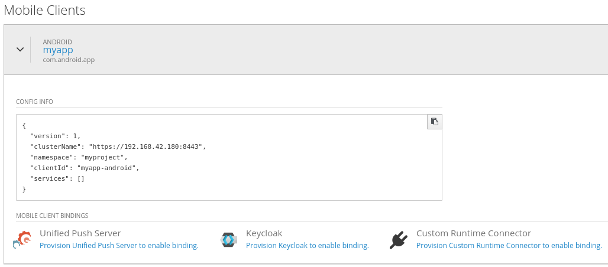
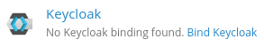
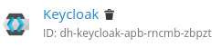

= Binding Mobile Clients to Services in OpenShift

Mobile Clients in OpenShift may be bound to particular services provisioned in the namespace to allow communication between them. 
The result of an binding produces a JSON configuration file (`mobile-services.json`) for your application which may be consumed by the Aerogear SDKs, allowing it to access the service (or services) it needs.

== Create a Mobile Client
A Mobile Client is a representation of your mobile application (Android, iOS, Cordova) in OpenShift. See link:./mobile-clients-in-openshift.adoc[this document] to learn more about Mobile Clients in OpenShift and how to create them. 

== Binding your Mobile Client to Services

Once you have created your Mobile Client, it is possible to
bind it to other services in OpenShift. This will allow your applications to interact with services provisioned in your namespace. 

=== Getting started
To get started, click on your Mobile Client from the overview screen, under the 'Mobile Clients' heading.
This will expand the Mobile Client view, showing configuration details for your application and a section for managing bindings.

The bindings section displays a list of all possible services your Mobile Client can be bound to. Bindings can be both created and deleted from this area. 

=== Creating bindings

A binding may be in one of 3 states at a single time: _not provisioned_, _available_ and _enabled_. 
These three states will be explained in further detail by binding an Android Application to Keycloak as an example.

==== Not provisioned

A binding is possible between the Mobile Client and the service, but the service has not yet been provisioned in the namespace. 

To create a new binding, simply click `provision Keycloak to enable binding`. This will allow you to provision the service as usual. In this case, Keycloak. 

==== Available

Once the service has been provisioned, it is now available to bind to your Mobile Client. 

To create a new binding, click  `bind Keycloak`. You will be prompted to bind your Mobile Client to this service via a binding modal. 

image:./images/keycloak-binding-modal.png[Keycloak Integration Enabled]

Enter the Client ID of your application, which can be found in the configuration details under `clientId`. In this case, `myapp-android` is the ID of the example Android application.

The client type dropdown allows you to choose the type of Keycloak client (bearer-only or public) that will be created for your application during the binding process. For more information about these two client types, see link:#[here].

==== Enabled

A binding now exists between the Mobile Client and the Keycloak service, and the `services` array in the configuration is automatically updated to reflect this association. 

image:./images/keycloak-client-config.png[Client Bindings Config]

To delete the binding, simply click on the trash can icon next to the service name. 

== Next steps

For in depth examples of binding your app to various services, see some of the following guides:

* link:./integrate-android-app-with-custom-service.adoc[Integrate an Android Application with your own backend service in OpenShift]