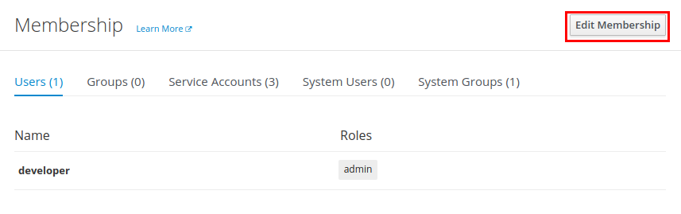
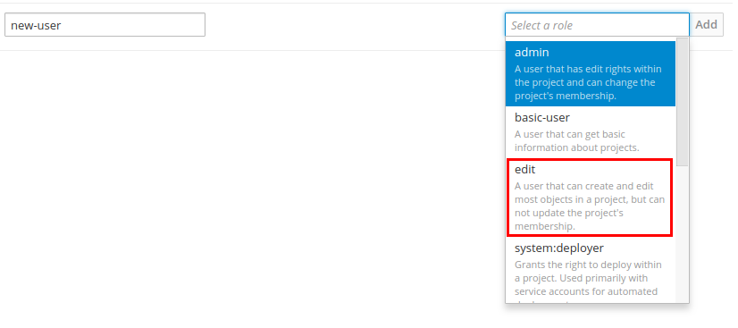
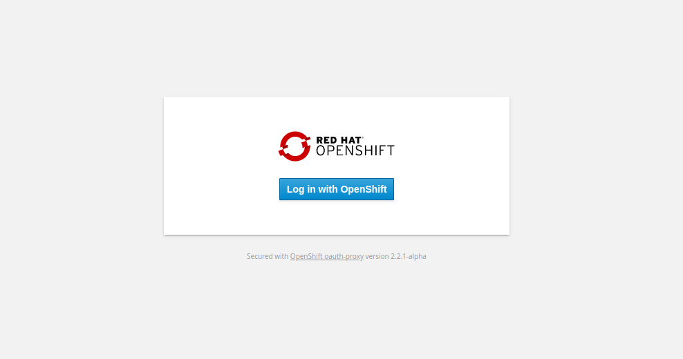
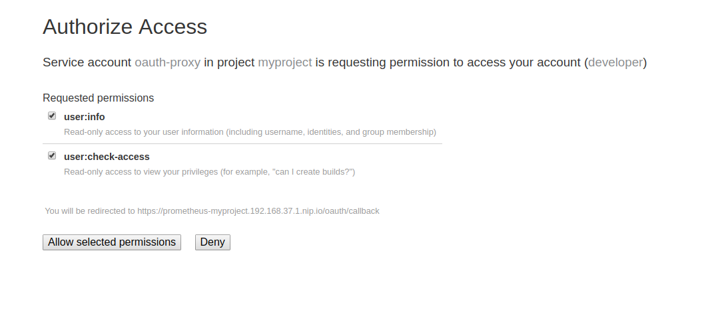

= Giving an Openshift user access to Metrics service

== Introduction

The metrics service creates routes to access Grafana and Prometheus. To protect these routes there is an OAuth reverse proxy sidecar container in front 
of the Grafana and Prometheus containers to enable authentication. The authentication is based on Openshift permissions and is configured as part of the 
provisioning of the metrics service. You can refer to the documentation for the proxy container link:https://github.com/openshift/oauth-proxy[here] for 
more detailed information on how the proxy can be configured. 

== OAuth proxy permissions
The OAuth proxy, uses a Subject Access Review rule defined in the deploymentConfig to specify what permissions are required to access the protected
routes. This rule is defined by _openshift-sar_. For the Prometheus deploymentConfig in the metrics service this definition is:
[source,yaml]
----
--openshift-sar={"namespace":"{{ namespace }}","resource":"deploymentconfigs","name":"prometheus","verb":"update"}
----

This means that for a user to be able to successfully authenticate against the OAuth proxy they must have 
sufficient permissions to update the deploymentConfig named, in this case, prometheus in the current Openshift namespace. 
The deploymentConfig for Grafana contains the same Subject Access Review rule for Grafana.

WARNING: Giving a user update permissions on a resource will give them the ability to replace that resource object with a complete and modified configuration.
Access to the Prometheus and Grafana routes requires permissions to completely edit and replace the Prometheus and Grafana  deploymentConfigs.

== Giving a user permissions from Openshift UI

. In your Project highlight *resources* and click on *Membership*.
. In the membership screen click on *Edit Membership*.
+

. Click on the dropdown under _Add Another Role_, click the *edit* role and click *add* to add the role to the user.
+

. The user can now access the Metrics routes.

== Giving a user permissions from commandline

. To find who currently has required permissions.
+
[source,bash]
----
oc adm policy who-can update dc
----
. To add edit role to specified user.
+
[source,bash]
----
oc adm policy add-cluster-role-to-user edit <user>
----
. The user can now access the Metrics routes.

== OAuth proxy usage

When the metrics service has been provisioned there will be a route for Grafana and a route for Prometheus. 
When you access one of the routes you will see the OAuth proxy landing screen.

Click *Log in with Openshift* and you will be brought to an Openshift login screen. If you have sufficient permission to access the route
once you have logged in with your Openshift credentials you will be asked to allow the service account
to access your account.

Click *Allow selected permissions* to allow the service account to check you have the required permissions to access
the service. The OAuth proxy will then redirect you to the requested route after you have been authenticated.

== Additional Resources

* link:https://docs.openshift.com/container-platform/3.5/architecture/additional_concepts/authorization.html[Openshift Authorization]
* link:https://github.com/openshift/oauth-proxy[Openshift OAuth Proxy container]