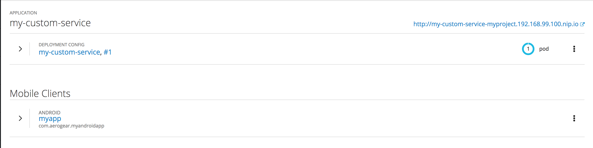
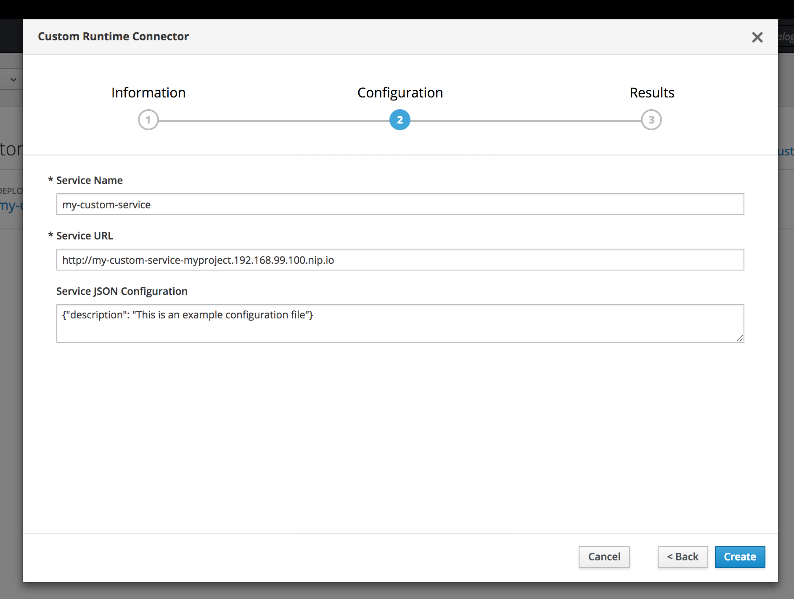
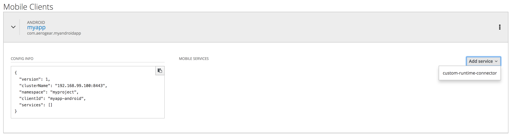
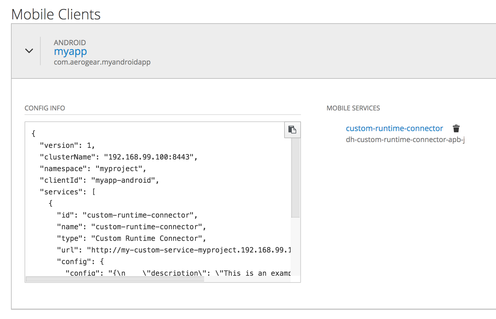

= Integrate an Android Application with Custom Services Running in OpenShift

This document describes the steps needed to configure the Aerogear Android SDK to allow your Android app to interact with:

* Your own backend services in OpenShift
* External backend services

== Prerequisites

* link:./create-android-client-on-openshift.adoc[Create an Android Mobile Client in OpenShift]

== Procedure

For demonstration, this guide uses the example Python application which can be found in the OpenShift Service Catalog. The same steps can be followed any HTTP web service running in OpenShift that has a publicly accessible route.

Pictured below is the example Python application, and the Android mobile client provisioned in OpenShift.

=== Provision the Custom Runtime Connector

We can connect our mobile client to our backend service by provisioning a **Custom Runtime Connector** from the OpenShift Service Catalog.

* Select the Custom Runtime Connector from the Service Catalog.
* Put the service name in the service name field. This name will be used in the SDK to retrieve details about the service.
* Put the publicly accessible url of the service in the Service URL field.
* In the Service Config field, place any additional configuration that might be needed by the mobile app in order to communicate with the backend service. **This must be a valid JSON format**.
* Click 'Create'.

Note that provisioning the Custom Runtime Connector simply creates a Config Map that is used to populate the `mobile-services.json` file which is consumed by your mobile application. It does not deploy any new services.

=== Add the Custom Runtime Connector Service to the Mobile Client

* Click the Mobile Client to reveal the JSON configuration. The 'services' list is empty.
* Click the 'Add Service' button and select 'custom-runtime-connector' from the dropdown menu.

* The 'services' list in the Mobile Client Configuration now includes a configuration object that contains details related to your backend service such as the name, uri and custom configuration.

=== Integrate your Android Application with the Custom Service

Take a copy of the JSON configuration from the mobile client and save it in `app/src/main/assets/mobile-services.json` in your Android application's source code.

Now the Aerogear SDK can be used to get the configuration for your custom service and it is possible to make requests. Please look at the example code below:

[source,java]
--
// get the service URL
final ServiceConfiguration serviceConfiguration = mobileCore.getServiceConfiguration("custom-runtime-connector");
final String serviceUrl = serviceConfiguration.getUrl();

// make the request
HttpRequest httpRequest = mobileCore.getHttpLayer().newRequest();
httpRequest.get(serviceUrl);
HttpResponse httpResponse = httpRequest.execute();

httpResponse.onError(() -> {
    // handle error
});

httpResponse.onSuccess(() -> {
    // handle success
});

httpResponse.onComplete(() -> {
    // called regardless success or error
});
--

