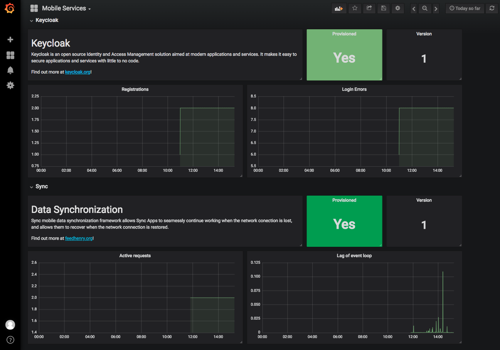
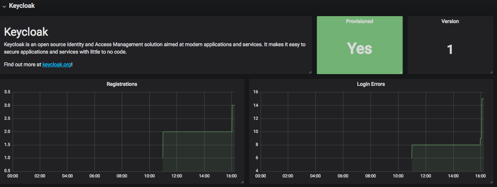
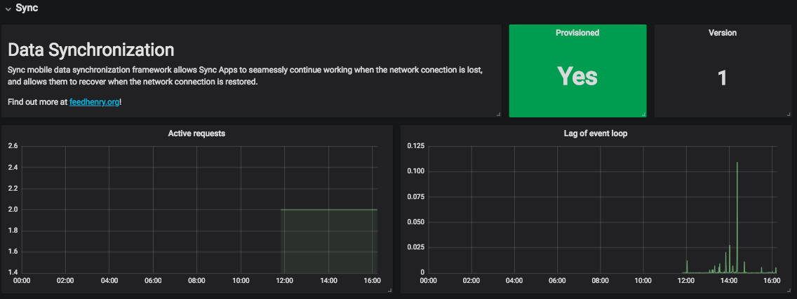

= Mobile Services dashboard in Grafana

== Prerequesites

* OpenShift Origin >= 3.7
** https://docs.openshift.org/latest/install_config/index.html
* OpenShift Ansible Broker
** https://docs.openshift.org/latest/install_config/install/advanced_install.html#configuring-openshift-ansible-broker
* Metrics service deployment from the Service Catalog
** https://github.com/aerogearcatalog/metrics-apb

== Overview

After the Metrics service (includes Grafana tool and Prometheus monitoring system) is provisioned, 
you should be able to see the "Mobile Services" in the list of available dashboards 
(navigate to Grafana's exposed URL -> Log in -> Home -> Select *Mobile Services*)

The dashboard contains 2 rows with panels, each row for a different service. 
See the description below for more information about each service's panels.

== 1. Keycloak

=== Keycloak service description

This panel just gives you basic information about the Keycloak service

=== Provisioned

This panel informs you about the status of connection with the Keycloak service.

If you want the Keycloak service's metrics data to be available for Graphana, you first need to deploy it
from the Service Catalog: https://github.com/aerogearcatalog/keycloak-apb

*Note:* Keycloak service must be provisioned within the same namespace,
otherwise the Keycloak's metrics endpoint won't be reachable for Prometheus and no data will be displayed.

=== Version

Shows the information about the version of the Node.js

=== Registrations

Total number of registered (non-admin) users. This number comprises all successful registrations made via various providers, e.g. Keycloak, Github, Facebook etc.

=== Login Errors

Total number of failed login attempts.

== 2. Sync

=== Sync service description

This panel just gives you basic information about the Sync service

=== Provisioned

This panel informs you about the status of connection with the Sync service.

If you want the Sync service's metrics data to be available for Graphana, you first need to deploy it
from the Service Catalog: https://github.com/aerogearcatalog/fh-sync-server-apb

*Note:* Sync service must be provisioned within the same namespace,
otherwise the Sync metrics endpoint won't be reachable for Prometheus and no data will be displayed.

=== Version

Shows the version number of the Keycloak service.

=== Active Requests

Number of active requests.

=== Lag of Event Loop

Lag of event loop in seconds.